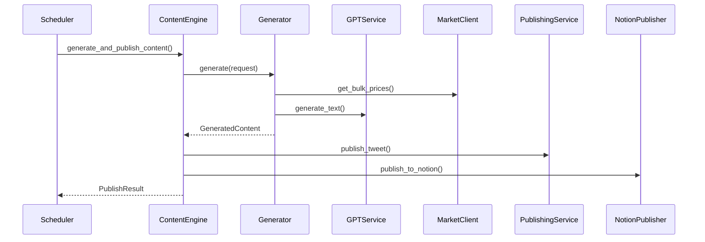
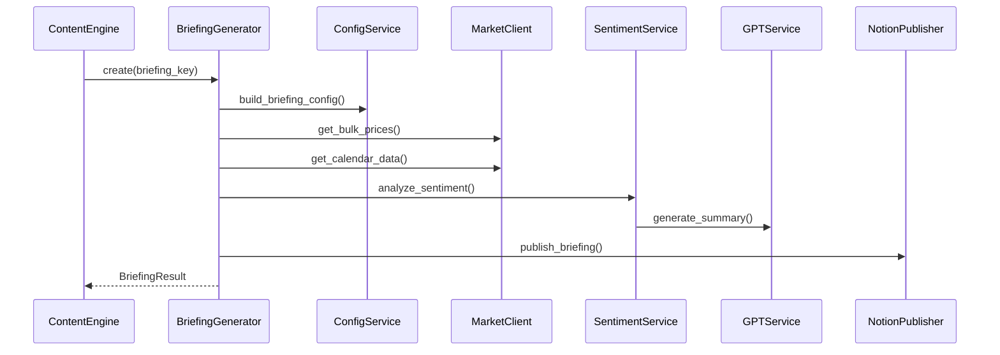

# HedgeFund Agent Architecture Guide

This document provides a comprehensive overview of the HedgeFund Agent system architecture, designed for scalability, maintainability, and institutional-grade financial content generation.

## 🏗️ System Architecture

### High-Level Design Philosophy

The HedgeFund Agent follows a **layered microservices-inspired architecture** within a monolithic deployment, providing the benefits of both approaches:

- **Modular Components**: Each service has a single responsibility
- **Dependency Injection**: Clean interfaces between layers
- **Event-Driven**: Asynchronous processing where appropriate
- **Scalable**: Components can be extracted to microservices as needed

### Architecture Layers

```
┌─────────────────────────────────────────────────────────┐
│                 Presentation Layer                       │
├─────────────────────────────────────────────────────────┤
│  scheduler.py  │  hedgefund_http_server.py             │
│  (Job Scheduler)│  (Website API)                        │
└─────────────────────────────────────────────────────────┘
┌─────────────────────────────────────────────────────────┐
│                 Orchestration Layer                      │
├─────────────────────────────────────────────────────────┤
│           core/content_engine.py                        │
│         (Main Business Logic Orchestrator)              │
└─────────────────────────────────────────────────────────┘
┌─────────────────────────────────────────────────────────┐
│                 Business Logic Layer                     │
├─────────────────────────────────────────────────────────┤
│  generators/          │  services/                      │
│  ├─commentary_generator│  ├─gpt_service                 │
│  ├─deep_dive_generator │  ├─market_client               │
│  └─briefing_generator  │  ├─database_service            │
│                       │  ├─publishing_service           │
│                       │  └─sentiment_service            │
└─────────────────────────────────────────────────────────┘
┌─────────────────────────────────────────────────────────┐
│                 Data Access Layer                        │
├─────────────────────────────────────────────────────────┤
│  PostgreSQL  │  Azure OpenAI  │  Market APIs           │
│  Database    │  GPT-4         │  Twitter API           │
│              │                │  Notion API             │
└─────────────────────────────────────────────────────────┘
```

## 🔧 Core Components

### 1. Content Engine (Orchestrator)

**File**: `core/content_engine.py`  
**Role**: Main orchestration hub that coordinates all content generation and publishing workflows.

**Key Responsibilities**:
- Pipeline orchestration for content generation
- Multi-platform publishing coordination  
- Error handling and retry logic
- System health monitoring
- Cross-service communication

**Scalability Features**:
- Async/await for concurrent operations
- Modular service injection
- Configurable retry mechanisms
- Health check aggregation

```python
# Example usage
engine = ContentEngine()
result = await engine.generate_and_publish_content(request)
```

### 2. Content Generators

**Pattern**: Strategy Pattern for different content types

#### Commentary Generator
- **Purpose**: Single-tweet market commentary with institutional perspective
- **Features**: Notion-backed diversity tracking, real-time market data enrichment
- **Scalability**: Stateless design, configurable generation parameters

#### Deep Dive Generator  
- **Purpose**: Multi-part analytical threads (2-4 tweets)
- **Features**: Thread management, complex market data integration
- **Scalability**: Parallel market data fetching, modular thread construction

#### Briefing Generator
- **Purpose**: Comprehensive market briefings with PDF generation
- **Features**: Multi-asset sentiment analysis, economic calendar integration
- **Scalability**: Concurrent data fetching, modular analysis components

### 3. Service Layer

#### Database Service (`services/database_service.py`)
- **Pattern**: Repository Pattern
- **Features**: Connection pooling, transaction management, query optimization  
- **Scalability**: Async wrapper support, read/write splitting ready

#### GPT Service (`services/gpt_service.py`)
- **Pattern**: Facade Pattern for Azure OpenAI
- **Features**: Intelligent prompting, response validation, rate limiting
- **Scalability**: Request batching, intelligent retry with backoff

#### Market Client (`services/market_client.py`)
- **Pattern**: Unified HTTP client for multiple data sources
- **Features**: Bulk requests, response caching, fallback mechanisms
- **Scalability**: Concurrent API calls, circuit breaker pattern

#### Publishing Service (`services/publishing_service.py`)
- **Pattern**: Multi-platform publisher with unified interface
- **Features**: Twitter/X posting, engagement tracking, rate limit handling
- **Scalability**: Queue-ready design, batch publishing capabilities

## 📊 Data Flow Architecture

### Content Generation Flow



### Briefing Generation Flow



## 🗄️ Database Schema Architecture

### Schema Organization

```sql
-- Shared platform database with agent-specific schemas
agents_platform/
├── shared/              -- Cross-agent shared tables
│   ├── system_logs      -- Centralized logging
│   └── agent_registry   -- Agent registration
└── hedgefund_agent/     -- Agent-specific schema
    ├── headlines        -- News headlines with scoring
    ├── themes           -- Content theme tracking
    ├── briefings        -- Briefing metadata
    ├── stock_universe   -- Symbol management
    └── market_blocks_config -- Briefing configuration
```

### Key Tables

#### Headlines Management
```sql
CREATE TABLE hedgefund_agent.headlines (
    id SERIAL PRIMARY KEY,
    headline TEXT NOT NULL,
    summary TEXT,
    score INTEGER,
    category VARCHAR(50),
    source VARCHAR(100),
    url TEXT,
    used BOOLEAN DEFAULT FALSE,
    used_at TIMESTAMP,
    created_at TIMESTAMP DEFAULT NOW()
);
```

#### Theme Deduplication  
```sql
CREATE TABLE hedgefund_agent.themes (
    id SERIAL PRIMARY KEY,
    theme VARCHAR(255) UNIQUE NOT NULL,
    usage_count INTEGER DEFAULT 1,
    first_used_at TIMESTAMP DEFAULT NOW(),
    last_used_at TIMESTAMP DEFAULT NOW()
);
```

### Scalability Considerations

- **Partitioning Strategy**: Time-based partitioning for headlines and logs
- **Indexing**: Composite indexes for common query patterns
- **Connection Pooling**: PgBouncer for connection management
- **Read Replicas**: Ready for read/write splitting

## 🔄 Job Scheduling Architecture

### Production Scheduler Design

**File**: `scheduler.py`  
**Pattern**: Command Pattern with error handling wrapper

#### Scheduling Strategy
- **BST/GMT Awareness**: Automatic timezone handling for UK markets
- **Error Isolation**: Failed jobs don't affect other scheduled tasks
- **Comprehensive Monitoring**: Telegram notifications for all job states

#### Job Categories

1. **Content Generation Jobs**
   - Commentary: 9 times daily
   - Deep Dives: 3 times weekly  
   - Briefings: 4 times daily

2. **Maintenance Jobs**
   - Headline pipeline: Every 30 minutes
   - Health checks: Every 30 minutes
   - Daily cleanup: Nightly

3. **Monitoring Jobs**
   - Heartbeat: Hourly
   - System metrics: Every 15 minutes

#### Scalability Features
- **Job Isolation**: Each job runs in protected wrapper
- **Retry Logic**: Configurable retry mechanisms
- **Load Balancing**: Ready for distributed scheduling
- **Monitoring Integration**: Full observability stack

## 🌐 External Integration Architecture

### API Client Design Pattern

All external services follow a consistent client pattern:

```python
class ExternalServiceClient:
    def __init__(self):
        self.base_url = config.SERVICE_URL
        self.session = aiohttp.ClientSession()
    
    async def get_data(self, params):
        # Unified error handling
        # Retry logic
        # Response validation
        # Logging
```

### Integration Points

#### Market Data Integration
- **Primary**: Market Data Service (internal microservice)
- **Fallback**: Direct API integrations (Yahoo Finance, Finnhub)
- **Pattern**: Circuit breaker with automatic fallback

#### Social Media Integration
- **Twitter API v2**: Tweet publishing and engagement tracking
- **Rate Limiting**: Intelligent backoff with queue management
- **Error Handling**: Graceful degradation with notification alerts

#### Content Management Integration
- **Notion API**: Website database integration
- **Pattern**: Eventual consistency with retry logic
- **Features**: Automatic content categorization and engagement sync

## 📈 Scalability Roadmap

### Phase 1: Current Monolithic Architecture
- ✅ Modular service design
- ✅ Async processing capabilities
- ✅ Database optimization
- ✅ Comprehensive monitoring

### Phase 2: Horizontal Scaling Preparation
- 🔄 Connection pooling optimization
- 🔄 Service interface standardization  
- 🔄 Configuration management centralization
- 🔄 Metrics and observability enhancement

### Phase 3: Microservices Migration (Future)
- 📅 Content generation service extraction
- 📅 Market data service separation
- 📅 Publishing service isolation
- 📅 Event-driven architecture implementation

### Phase 4: Cloud-Native Architecture (Future)
- 📅 Kubernetes deployment
- 📅 Message queue integration (RabbitMQ/Kafka)
- 📅 Distributed caching (Redis)
- 📅 Auto-scaling implementation

## 🔐 Security Architecture

### API Security
- **Environment-based Secrets**: All API keys externalized
- **Request Validation**: Comprehensive input validation
- **Rate Limiting**: Protection against API abuse
- **SQL Injection Prevention**: Parameterized queries only

### Data Security
- **Database Encryption**: At-rest encryption for sensitive data
- **Secure Connections**: TLS for all external communications
- **Access Controls**: Role-based database permissions
- **Audit Logging**: Comprehensive audit trail

## 📊 Monitoring & Observability

### Logging Strategy
- **Structured Logging**: JSON-formatted logs with correlation IDs
- **Log Levels**: Appropriate log level usage throughout
- **Centralized Aggregation**: Ready for log aggregation systems
- **Performance Metrics**: Query timing and API response metrics

### Health Monitoring
- **Service Health Checks**: Individual service health validation
- **System Health Aggregation**: Overall system health scoring
- **Proactive Alerting**: Telegram-based notification system
- **Performance Dashboards**: Ready for Grafana integration

### Error Handling Strategy
- **Graceful Degradation**: Fallback mechanisms for all external dependencies
- **Retry Logic**: Exponential backoff for transient failures  
- **Circuit Breakers**: Automatic service isolation for persistent failures
- **Error Aggregation**: Comprehensive error tracking and analysis

## 🚀 Deployment Architecture

### Production Environment
- **Process Management**: Supervisor for robust process control
- **Service Monitoring**: Health checks and automatic restarts
- **Log Management**: Centralized logging with rotation
- **Resource Management**: Memory and CPU usage optimization

### Development Environment  
- **Local Database**: PostgreSQL with development data
- **API Mocking**: Mock external services for testing
- **Configuration Management**: Environment-specific configs
- **Testing Framework**: Comprehensive test suite

### Staging Environment
- **Production Parity**: Identical to production configuration
- **Integration Testing**: Full end-to-end testing capability
- **Performance Testing**: Load testing and optimization
- **Security Testing**: Vulnerability assessment and penetration testing

## 📋 Best Practices

### Code Organization
- **Single Responsibility**: Each class/module has one clear purpose
- **Dependency Injection**: Services injected rather than imported
- **Interface Segregation**: Clean interfaces between layers
- **Open/Closed Principle**: Extensible without modification

### Error Handling
- **Fail Fast**: Early validation and error detection
- **Graceful Recovery**: Fallback mechanisms for all external dependencies
- **Comprehensive Logging**: All errors logged with context
- **User-Friendly Messages**: Clear error communication

### Performance Optimization
- **Async Processing**: Non-blocking I/O for all network calls
- **Bulk Operations**: Batch processing where applicable
- **Caching Strategy**: Intelligent caching for repeated data
- **Database Optimization**: Efficient queries and proper indexing

### Testing Strategy
- **Unit Testing**: Individual component testing
- **Integration Testing**: Service interaction testing
- **End-to-End Testing**: Complete workflow validation
- **Performance Testing**: Load and stress testing

## 🎯 Future Enhancements

### Short-Term (Next 3 months)
- Enhanced sentiment analysis with additional data sources
- Real-time engagement tracking and optimization
- Advanced content personalization
- Performance optimization and caching

### Medium-Term (3-6 months)  
- Multi-language content generation
- Advanced portfolio integration
- Machine learning-based content optimization
- Enhanced market prediction capabilities

### Long-Term (6+ months)
- Full microservices architecture
- Real-time streaming data integration
- Advanced AI/ML content generation
- Multi-platform expansion

---

This architecture provides a solid foundation for scalable, maintainable, and robust financial content generation while maintaining the flexibility to evolve with changing requirements.